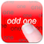
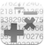

***

## snsrlog 
An app to record, stream and label sensor data
from the iPhone. It's geared towards developers and
researchers.

The app is written by Benjamin Thiel and
started as a software project under my supervision building
on previous tools we coded at the Embedded
Systems Lab in Passau (yet, so far I did not contribute
a single line of code to this new version ;)

***

##old apps

Here are some old, rather trivial apps I coded that are
still available on the App Store.

Click on the link next to the icon to get some more infos.

 [Blanks and More Blanks](./blanks.html) |
 [Odd One Out](./oddone.html) |
 [QuickMath](./math.html)

***

