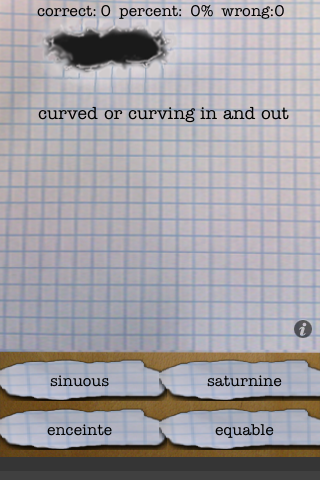
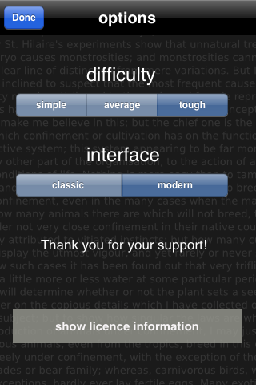

##Blanks

'Blanks'helps you to learn new 
English words. It shows you word definition and gives 4 choices as answer. 
Select one of the choices by dragging it on the hole in the paper. 
If you are correct, a green hock is displayed. 
If the selected word does not fit to the definition, you will see a red cross. 

##More Blanks

MoreBlanks is a simple game to learn English words, 
it builds on the Blanks application 
(freely available on the Appstore). 
It contains over 10.000 words with 
three difficulty settings. 

On the option screen, you can select
the difficulty level. 
To get to the option screen press the 
little i icon on the right side of 
the main screen over the word definitions. 

Select the word you think
fits the definition and drag it into the blank on top.

For support contact:
  iappsupport (at) gmail.com
